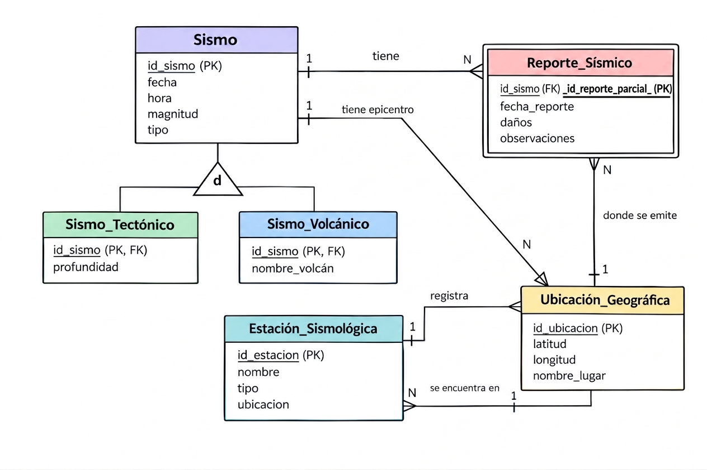

# Ejercicio 5. Modelo Entidad-Relación Extendido (EER) - Proyecto Asignado
**Proyecto:** Sistema de Visualización de Datos Sísmicos de México

## 1. Reconstrucción del Modelo Conceptual del Dominio
A diferencia del esquema dimensional (almacén de datos orientado al análisis), el modelo conceptual de este dominio representa los objetos del mundo real y sus interacciones físicas e institucionales antes de ser denormalizados:

* **Sismo (Evento Telúrico):** Representa la liberación repentina de energía en la corteza terrestre. Posee características físicas intrínsecas (magnitud, profundidad del hipocentro, fecha y hora exacta de ocurrencia).
* **Estación_Sismológica:** Infraestructura física que detecta y registra las ondas sísmicas mediante instrumentos.
* **Ubicación_Geográfica:** Espacio territorial delimitado (definido por coordenadas, estado y municipio) donde se localiza el epicentro de un sismo o la instalación de una estación.
* **Reporte_Sísmico:** Documento técnico oficial emitido por las autoridades sismológicas para divulgar los datos de un evento.

---

## 2. Diagrama del Modelo EER (Notación Crow's Foot)

---

## 3. Identificación de Jerarquías y Entidades Débiles en el Dominio

### Entidad Débil: `Reporte_Sísmico`
* **Tipo:** Dependencia de existencia e identificación.
* **Justificación:** Un reporte o actualización sísmica no puede existir de forma independiente en la realidad sin estar asociado a un **Sismo** específico previamente detectado. Su clave primaria en el dominio conceptual se forma por la combinación de la clave del sismo más la secuencia de revisión del reporte.

### Jerarquía de Especialización: `Evento_Telúrico`
* **Superclase:** `Sismo`
* **Subclases (Subtipos):**
  1. `Sismo_Tectónico`: Producido por el desplazamiento de placas tectónicas (posee atributos propios como *Placa_Origen* y *Tipo_Falla*).
  2. `Sismo_Volcánico`: Asociado a la actividad magmática (posee atributos propios como *Volcán_Asociado* y *Fase_Eruptiva*).
* **Restricciones de la Jerarquía:**
  * **Disyunción:** *Disjunta ($d$)*. Un evento telúrico particular responde a un mecanismo de origen tectónico o volcánico, pero no a ambos simultáneamente.
  * **Completitud:** *Parcial ($p$)*. Existen sismos inducidos que no entran en estas dos categorías principales.

---

## 4. Tabla de Correspondencia entre el Modelo Conceptual y el Esquema Publicado

| Entidad Conceptual del Dominio | Tabla(s) en el Esquema Publicado | Información que se Pierde | Información que se Agrega / Transforma |
| :--- | :--- | :--- | :--- |
| **Sismo** | `dim_sismos` / Tabla de hechos | Se pierden los registros de revisiones intermedias y el historial de correcciones de magnitud enviadas por los sensores. | Se agregan claves subrogadas analíticas (*Surrogate Keys*), atributos precalculados y formatos estandarizados de fecha/hora. |
| **Ubicación_Geográfica** | `dim_sismos` (campos `estado`, `latitud`, `longitud`) | Se pierde la jerarquía geográfica completa del dominio (relaciones entre regiones sísmicas, cuencas e infraestructura municipal). | Se aplanan (*denormalizan*) las coordenadas en la misma tabla del sismo para simplificar las consultas GIS y el mapeo. |
| **Estación_Sismológica** | No existe una tabla explícita | Se pierde la trazabilidad de qué estación/sensor específico detectó el evento y la calidad instrumental del registro. | Los datos provenientes de la red de estaciones se abstraen en un único valor condensado de magnitud y epicentro. |
| **Reporte_Sísmico** | No existe en el esquema | Se pierde la auditoría de boletines emitidos y la firma del personal técnico responsable del reporte. | La información se consolida exclusivamente en el registro sísmico definitivo. |