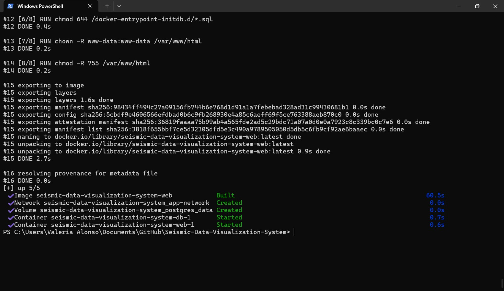
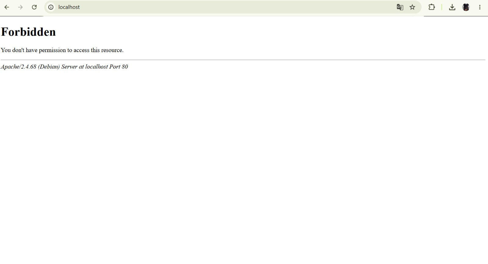
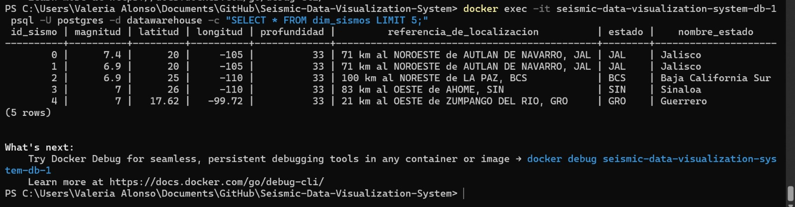

# Levantar el Proyecto Asignado: Sistema de Visualización de Datos Sísmicos

**URL del Fork:** https://github.com/ValeAlonso-star/Seismic-Data-Visualization-System  
**Proyecto:** Sistema de Visualización de Datos Sísmicos de México  
**Integrantes:**
* Alonso Peña Valeria Elide
* Pérez Mateos Evelyn Yamilet
* Martinez Gonzalez Irvin

---

## 1. Requisitos del Sistema
* Docker Desktop / Docker Engine
* Python 3.11+ / Conda
* PostgreSQL con extensión PostGIS
* Navegador Web (Chrome / Firefox / Edge)

## 2. Pasos de Instalación y Puesta en Marcha
1. Clonar el repositorio del fork:
   ```bash
   git clone [https://github.com/ValeAlonso-star/Seismic-Data-Visualization-System.git](https://github.com/ValeAlonso-star/Seismic-Data-Visualization-System.git)
   cd Seismic-Data-Visualization-Systems
   
## 4. Documentación de Errores Encontrados y Diagnóstico

### Paso en el que se presenta la observación
Despliegue y acceso a la interfaz web del sistema mediante el contenedor `seismic-data-visualization-system-web-1` (Mapeo de puerto `80:80`) 

### Descripción del error y mensaje recibido
Al desplegar los contenedores con `docker compose up -d`, la base de datos PostgreSQL en el puerto `5433` y el servicio Apache/PHP en el puerto `80` iniciaron correctamente. Sin embargo, al ingresar desde el navegador web a la dirección `http://localhost`, el servidor devuelve el mensaje HTTP 403:

> **Forbidden**  
> *You don't have permission to access this resource.*  
> *Apache/2.4.68 (Debian) Server at localhost Port 80*

### Diagnóstico Técnico
1. **Contenedores y Base de Datos:** Se verificó mediante `docker ps` que ambos contenedores están activos. La base de datos `datawarehouse` es plenamente funcional y responde a consultas SQL en la tabla `dim_sismos`.
2. **Servidor Web:** El contenedor web responde en el puerto 80, pero el servidor Apache deniega el acceso a la raíz (`/`) debido a que la estructura del proyecto carece de un archivo de índice público asignado al `DocumentRoot` configurado.

---

## 5. Evidencias de Funcionamiento

### 1. Arranque de Contenedores en Terminal


### 2. Respuesta del Servidor Web (Mensaje de Error HTTP 403)


### 3. Consulta a la Base de Datos PostgreSQL
